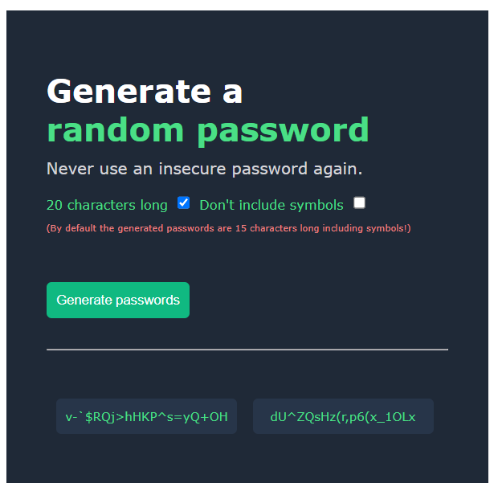

# Random Password Generator Project

This is a simple project that allows you to generate random passwords with different options. The passwords are generated using HTML, CSS, and JavaScript.

## Features

- Generate random passwords with default length of 15 characters, including symbols.
- Customize password length to 20 characters.
- Option to exclude symbols from the generated passwords.

## How to Use

1. Open the `index.html` file in your web browser.
2. Check the "20 characters long" checkbox if you want to generate 20-character passwords.
3. Check the "Don't include symbols" checkbox if you want to exclude symbols from the generated passwords.
4. Click the "Generate passwords" button to generate two random passwords.
5. The generated passwords will be displayed below the button.

## Preview

## Code Explanation

The project consists of three main components: `index.html`, `index.css`, and `index.js`.

### `index.html`

This file contains the HTML structure of the project. It includes the necessary CSS and JavaScript files and sets up the user interface with checkboxes, labels, and a button.

### `index.css`

The CSS file styles the layout and appearance of the password generator. It defines the fonts, colors, and layout properties.

### `index.js`

The JavaScript file contains the logic for generating the random passwords based on the user's choices. It defines two arrays: `characters` and `withoutSymbols`, which contain the characters used to generate the passwords with and without symbols, respectively.

The `randPass` function generates two passwords based on the selected options (i.e., whether to include symbols and whether the passwords should be 20 characters long). It then updates the HTML elements to display the generated passwords.

The event listeners are set up for the "Generate passwords" button and the two password spans (`outputOne` and `outputTow`). When the button is clicked, the `randPass` function is called to generate new passwords. When a password span is clicked, the password text is copied to the clipboard using the `copyTextToClipboard` function.

## Disclaimer

This project is intended for educational purposes only and should not be used for actual security-critical applications. Always use strong and unique passwords for important accounts and consider using a reputable password manager for secure password management.
